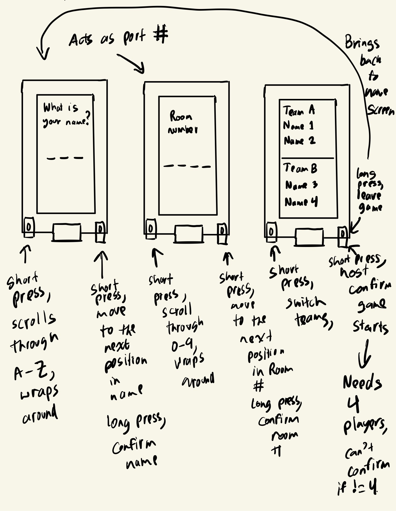
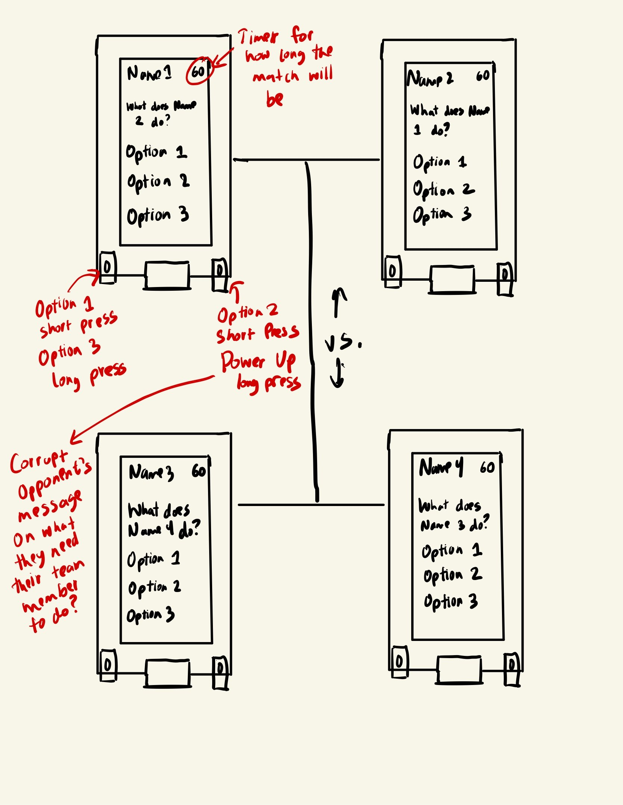
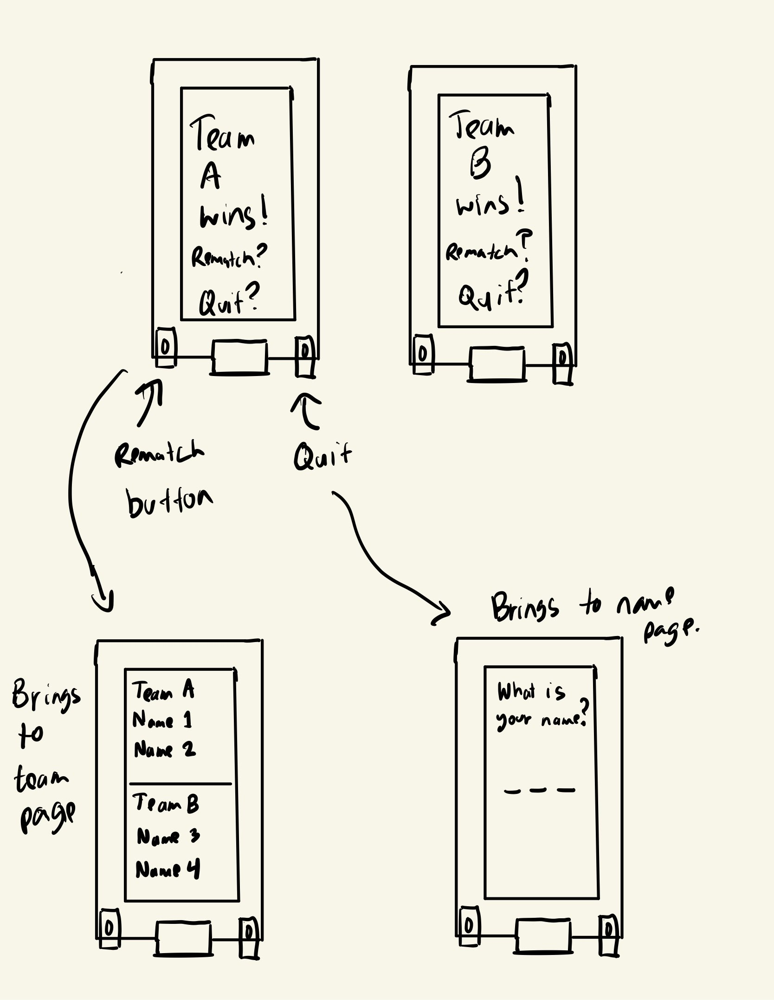

# ESP32-SpaceTeam
Creative Embedded System Module 3 Project: This project uses the TFT_eSPI, WiFi.h, esp_now.h, and SPI.h libraries with the Lilygo TTGO ESP32 and Arduino IDE to play a 2 vs. 2 SpaceTeam game with your friends.

## Demo
[


## Blog Post

You can take an in depth look at our process making this program in this [blog post](PLACEHOLDER).

## Table of Contents

- [Features and Tools](#features-and-tools)
- [How to Build the Project](#how-to-build-the-project)
- [Concept Design](#concept-design)
- [Contributors](#contributors)

## Features and Tools

- [Arduino IDE](https://support.arduino.cc/hc/en-us/articles/360019833020-Download-and-install-Arduino-IDE)
- [Lilygo TTGO ESP32](https://www.amazon.com/LILYGO-T-Display-Arduino-Development-CH9102F/dp/B099MPFJ9M?th=1)
- USB-C cable
- Three friends (you'll need four players to start the game!)

## How to Build the Project 

1. Clone the repository for each player:

   ```bash
   git clone https://github.com/asder8215/ESP32-SpaceTeam.git
   ```
2. From the espaceteam folder, import or move the `espaceteam.ino` file into Arduino Folder
    * If Arduino IDE is not installed, look at this [Arduino Support Page](https://support.arduino.cc/hc/en-us/articles/360019833020-Download-and-install-Arduino-IDE) on how to install the Arduino IDE.

3. Follow these [installation steps](https://coms3930.notion.site/Lab-1-TFT-Display-a53b9c10137a4d95b22d301ec6009a94) to correctly set up the libraries needed to write and run code for TTGO ESP32.

4. Once your Arduino IDE is set up, you can connect your ESP32 to your laptop or computer via USB-C and click on the `Upload` button on the top left of the Arduino IDE. This will make the code compile and store onto the ESP32.

5. After the code is uploaded, the ESP32 will display prompts asking you to use the left and right buttons to choose your name, room, and team. This will allow four players to be divided into two teams and play against each other.
    * On the name selection screen: Short press the left button to scroll through A-Z, short press the right button to confirm the current character and move to the next character, and long press the right button to confirm the name. The name is three letters long.
    * On the room selection screen: Short press the left button to scroll through 0-9, short press the right button to confirm the current digit and move to the next digit, and long press the right button to confirm the room number. The room number is four digits long; be sure to enter exactly the same room number as your friends.
    * On the team selection screen: Short press the left button to toggle between Team A and Team B. A medium press of the left button exits the team screen and returns to the room screen. Short press the right button to toggle the readiness status of the local player. Long press the right button to attempt to start the game if conditions are met. The game can proceed only if both teams have at least two players who are marked as ready.

6. Start playing the game. Game rules: [Placeholder - to be added].

7. After the game ends, press the left button to rematch, which re-enters the team selection process to set up a new game; press the right button to exit the current game session and return to the name selection screen.

8. If you are unsure of how to play the game or want a quick guide, refer to the demo above to see how it works!

## Concept Design

These contain images of our SpaceTeam concept design. Some of these images may not be implemented or changed on how it works/shown in the game as it is currently.

- Initial Screen

- Game Screen

- End Screen


## Contributors

- Mahdi Ali-Raihan
- Enrista Ilo
- Christine Lam
- Jie Ji
